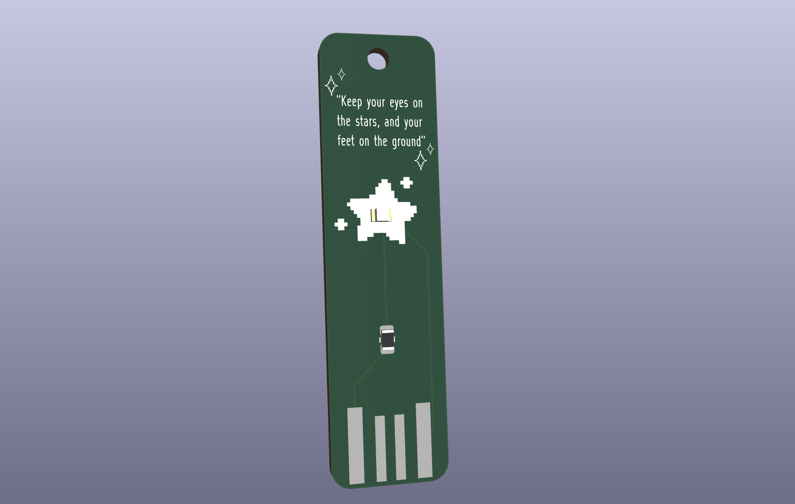
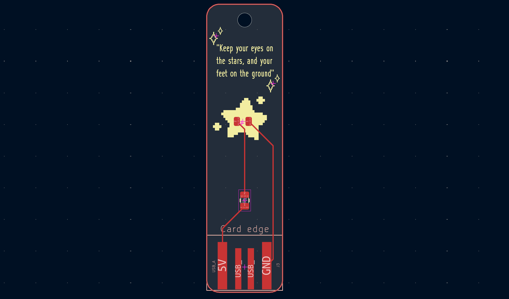

# Aesthetic PCB Keychain

## A keychain that lights up when plugged into a computer!

## Created with KiCAD

### I used the USB_A_PCB Mod from this GitHub Repository: [Link to SparkFun-Kicad-Libraries](https://github.com/benwis/SparkFun-Kicad-Libraries/blob/master/SparkFun-Connectors.pretty/USB-A-PCB.kicad_mod)

## 3D Model Image

## PCB Image
